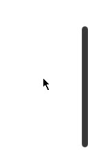
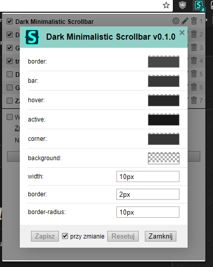

<h1 align="center"><i>Dark Minimalistic Scrollbar</i></h1>
Working on Chrome, Opera and probably in any other WebKit based browsers. You can change colors and sizes for elements of scrollbar.

From version 0.1.4 minimal support for Firefox has been added such as thumb color, track color and scrollbar width.

## Installation
* Download Stylus extension: [Chrome](https://chrome.google.com/webstore/detail/clngdbkpkpeebahjckkjfobafhncgmne), [Opera](https://addons.opera.com/extensions/details/stylus/) (better use chrome web store because of newer version of stylus)  
*  (or from [userstyles.org](https://userstyles.org/styles/127819/dark-minimalistic-scrollbar))

  
## My other userstyles
https://userstyles.org/users/291236

## License
[CC-BY-SA-4.0](https://github.com/pabli24/DMScrollbar/blob/master/LICENSE)
